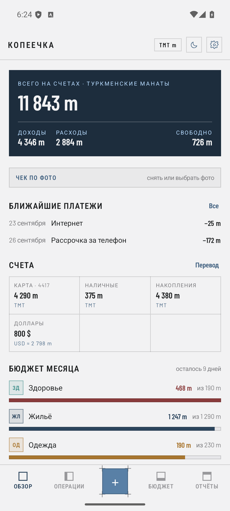
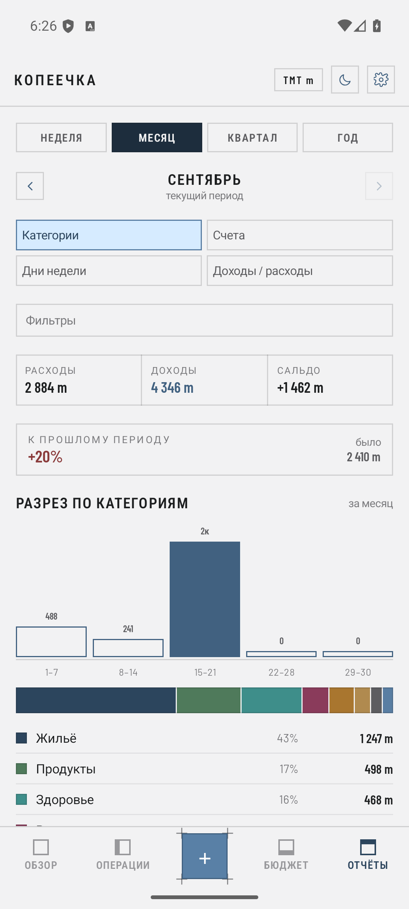
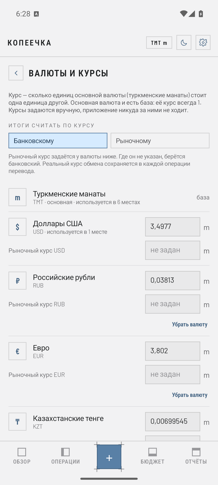

<h1 align="center">Копеечка</h1>

  <b>Деньги семьи — в одном телефоне, а не на чужом сервере.</b> 
  Одна покупка — навсегда: все функции сразу, без подписок, рекламы и регистрации.

  <a href="https://play.google.com/store/apps/details?id=com.arassanusga.kopeechka"><b>▶ Google Play</b></a>
  &nbsp;·&nbsp;
  <a href="PRIVACY.md">Политика конфиденциальности</a>
  &nbsp;·&nbsp;
  <a href="SUPPORT.md">Поддержка</a>
  &nbsp;·&nbsp;
  <a href="#english">English</a>

  
  
  

---

## Одна покупка — навсегда

Копеечка стоит 5 $ в Google Play, и это вся цена.

- **Платите один раз.** Никаких подписок, пробных периодов и «премиума», который
  дорожает каждый год.
- **Всё включено.** Нет урезанной бесплатной версии и покупок внутри приложения:
  СМС банков, общий бюджет, ИИ-советник, подсказки и защита — сразу у всех.
- **Обновления входят в покупку.**
- **Вы — покупатель, а не товар.** Без рекламы, аналитики и сервера: зарабатывать на
  ваших данных приложению незачем и нечем.

## Почему Копеечка

Большинство финансовых приложений сделаны для одной страны, одной валюты и одного
человека. Копеечка — для жизни, как она устроена в СНГ:

- 💱 **Манат, сум, тенге, рубль и доллар — на равных.** У валюты два курса, банковский
  и рыночный, и итог считается по тому, который вы выбрали.
- 📩 **Банк сам пишет расходы.** Банковские СМС и уведомления превращаются в операции —
  только с вашего разрешения и только от отправителей из ваших правил.
- 👫 **Бюджет на двоих.** Два телефона ведут одни счета — даже без интернета, напрямую
  по Wi-Fi. Крупные траты с общего счёта ждут «да» второго.
- 🔒 **Без сервера.** Данные лежат только на вашем телефоне. Нет регистрации, рекламы,
  аналитики и трекеров. PIN-код, вход по отпечатку, «скрыть суммы» и копии под паролем.
- 💡 **Подсказывает само.** Хватит ли денег до зарплаты, где траты выросли, какие
  списания похожи на подписки — без интернета и без ИИ.
- 🎨 **Три темы** — «Чертёж», «Спокойная» и «Неон», светлые и тёмные, и отдельная настройка
  размера текста.
- 🌐 **Пять языков**: русский, английский, туркменский, узбекский и казахский.

## Что умеет

**Деньги.** Карты, наличные, накопления, вклады и золото в граммах в общем итоге. 70 мировых
валют и свои собственные, официальные курсы ЦБ России, Нацбанка Казахстана и ЦБ Узбекистана
одной кнопкой. Регулярные платежи с напоминанием, долги, цели и модуль «Бизнес»: заказы,
клиенты, прайс, выручка и маржа.

**Без ручного ввода.** Банковские СМС и уведомления, QR-код с чека (без интернета), выписка
банка в CSV, фото чека через ИИ по вашему ключу, шаблоны частых трат в одно касание, запись
голосом, виджет на рабочий стол. Всё найденное сначала попадает на экран «На проверку» —
в деньги ничего не пишется без вашего подтверждения.

**Понимание.** Прогноз «до зарплаты», итоги недели, предупреждение о всплеске трат,
капитал по месяцам, цели со сроком, ожидаемый доход против факта, месячные лимиты по
категориям, отчёты за неделю, месяц, квартал и год со сравнением, ИИ-советник на ваших
данных: Claude, OpenAI, Gemini, GigaChat, YandexGPT или своя модель.

**Данные под контролем.** Резервная копия в ваш Google Диск или файлом. Ключи ИИ и пароли —
в защищённом хранилище телефона. Что и когда уходит в сеть — в
[политике конфиденциальности](PRIVACY.md).

## Документы

| Документ | Для чего |
| --- | --- |
| [Политика конфиденциальности](PRIVACY.md) | какие данные где хранятся и когда покидают телефон |
| [Поддержка](SUPPORT.md) | как связаться, частые вопросы, удаление данных |
| [Сообщить о проблеме](https://github.com/MerdanOchanov/kopeechka/issues) | ошибки и пожелания |

---

## English

**Kopeechka** is a personal and family finance app with no server of its own: your data stays
on your phone, with no ads, analytics or sign-up.

**Pay once, keep it forever.** $5 on Google Play is the whole price: no subscription, no
trial, no in-app purchases and no cut-down free version. Every feature is included, and
future updates are part of the purchase.

- Accounts in any currency — including Turkmen manat, Uzbek som and Kazakh tenge — with bank
  and market rates, official central bank rates in one tap, and gold in grams.
- Hands-free input: bank SMS (with your permission) and notifications, receipt QR codes, bank
  statement CSV and AI receipt photos, all landing in a review queue first.
- A shared budget for two over Google Drive, WebDAV or directly over Wi-Fi.
- Budgets, reports, goals with deadlines, debts, recurring payments and a small-business module.
- Insights on the phone: will the money last until payday, where spending jumped, which
  charges look like subscriptions, net worth by month.
- A PIN and fingerprint lock, hide amounts with one tap, password-protected backups.
- AI advisor on your own key. Three themes and a text size setting. Five languages.

[Get it on Google Play](https://play.google.com/store/apps/details?id=com.arassanusga.kopeechka) ·
[Privacy policy](PRIVACY.md#privacy-policy-english) · [Support](SUPPORT.md#english)
